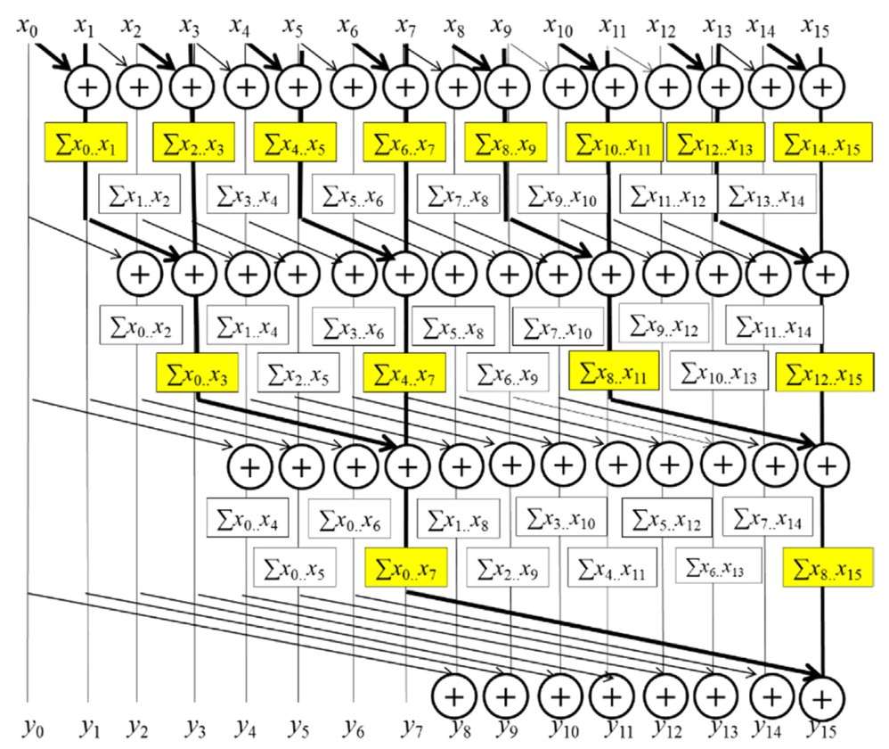

# Coursework 3

## Goal

Your task for this week is to implement a parallel **inclusive scan** (prefix sum) for an array of complex numbers based the [Kogge-Stone algorithm](https://apps.dtic.mil/sti/pdfs/ADA074455.pdf) for fast adder circuits:

Complex numbers are represented as adjacent pairs of floats representing the real and imaginary part (see `slow_scan.cu`).
N complex numbers are therefore represented as an arry of N*2 floats.

The operation for the scan is **complex multiplication**.

## Points

The parallel scan has to be computed on the GPU.
Half of the points are awarded for correctness.

The other half are awarded for implementing optimizations as discussed in the lecture.

We recommend implementing the optimizations in the following order:
1) Reducing Divergence
2) Shared Memory Utilization
3) Thread Coarsening
4) Memory Coalescing (optional)

