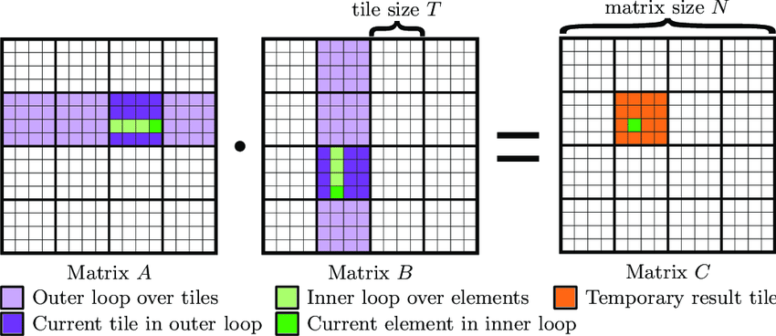

# This Week's Coursework

The coursework for this week comes with two tasks.
Task 1 is to implement overlapping of communication and computation using streams.
Task 2 is to optimize a tiled matrix multiplication kernel using the NVIDIA Nsight profiling tool.

## Task 1
Have a look at the provided `task.cu` file.
The function `matrixMultiplyNoStreams` implements a sequence of 10 matrix multiplications.
Implement a version where the communication and computation overlap using streams as discussed in the last lecture.
Implement this in the function `matrixMultiplyWithStreams`. There are a couple of TODOs to help you get started.

## Task 2
The kernel `matrixMultiplyKernel` in the `task.cu` file implements a naive matrix multiplication.
Implement a new kernel `matrixMultiplyKernelTiled` that implements tiled matrix multiplication which is explained below.
There are a couple of TODOs to help you get started.

Pick meaningful parameters for launching the kernel and the tile size.
Keep in mind the other optimizations that we talked about in class, such as memory coalescing, shared memory, and warp divergence.

For this coursework you may assume that the matrices are square and have a size that is a power of 2.

---

# Tiling a Matrix Multiplication

Matrix Multiplication (MM) is a ubiquitous task at the core of many applications (ML, Solvers, Ray Tracers, etc.) that lends itself especially well to the massively parallel nature of GPUs.
However, without memory access optimizations we are only able to achieve a small fraction of the theoretical FLOPs available to us.
Tiling is a very important optimizations used to optimize MM on GPUs by improving data locality and reducing memory access overhead, enabling efficient use of shared memory and furthermore enabling more advanced optimizations.

## 1. Basics of Matrix Multiplication

For two matrices \(A\) (size \(M \times K\)) and \(B\) (size \(K \times N\)), the resulting matrix \(C\) (size \(M \times N\)) is computed as:

\[
C[i, j] = \sum_{k=0}^{K-1} A[i, k] \cdot B[k, j]
\]

To compute \(C\), we need to access elements from \(A\) and \(B\) multiple times. Without optimization, each access to \(A\) and \(B\) may involve fetching data from slow global memory, which is expensive. As a result, the naive kernel is most likely to be memory bound.

Tiling addresses this by minimizing global memory accesses and maximizing shared memory usage.

## 2. What Is Tiling?

Tiling is a method of dividing the computation into smaller chunks or **tiles** of size \(T\) that fit into the GPU's shared memory.
Each tile focuses on a sub-region of \(A\), \(B\), and \(C\).
Threads collaboratively load these sub-regions into shared memory, perform the computation locally, and then write the results back to global memory.

## 3. A Recipe for Tiled Matrix Multiplication

1) Partitioning:
    The matrices \(A\), \(B\) and \(C\) are divided into tiles of size \(T \times T\).
    For example, if \(T = 16\), each thread block computes a \(16 \times 16\) tile of \(C\).

2) Thread Mapping:
    A thread block is assigned to compute one tile of \(C\). Each thread in the block is responsible for computing one element of the tile of \(C\).

3) Load Data into Shared Memory:
    Threads cooperatively load the necessary tile of \(A\) and \(B\) into shared memory.

4) Compute the Tile:
    Once \(A\) and \(B\) tiles are in shared memory, each thread computes its assigned part of the \(C\) tile. Threads iterate over the \(K\)-dimension in chunks of \(T\), using shared memory for intermediate results.

5) Write Results to Global Memory:
    After computing the partial sum for the tile, each thread writes its result back to the corresponding location in global memory for \(C\).

---
